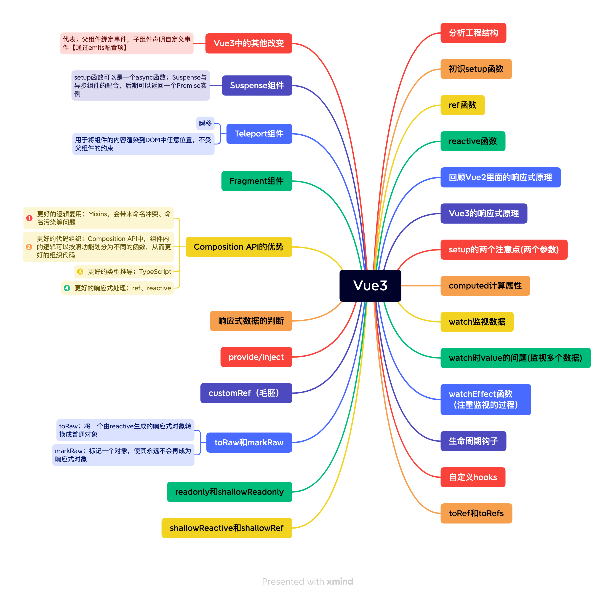

# Vue3


## Vue2和Vue3的区别
1. 生命周期不同
2. 多根节点
    - Vue2不支持
    - Vue3支持
3. Composition API
    - Vue2是选项式API
    - Vue3是组合式API; 可将同一逻辑的内容写到一起
4. 异步组件(Suspense)
    - 允许程序在等待异步组件加载完成前渲染兜底内容,如loading,使用户的体验更加平滑
5. Teleport
    - Vue3提供Teleport组件,可将部分DOM移动到Vue app之外的位置,**比如项目中常见的Dialog弹窗**
6. 响应式原理
    - Vue2; Object.defineProperty(直接在一个对象上定义新的属性或修改现有的属性,并返回对象)
    - Vue3; Proxy
        - Why?
        - 1、无法监听对象或数组新增、删除的元素
        - 2、
7. 虚拟DOM
    - Vue3的虚拟DOM上增加了patchFlag字段,
    ```
    _createElementVNode(div, null, _toDisplayString(_ctx.name), 1 /* TEXT */)
    ```
    - 解读: 1代表节点为动态文本节点,那么在diff过程中,只需对比文本内容,无需关注class、style、等
    - **发现所有的静态节点HOISTED为-1时,都保存一个变量为静态提升**,可在渲染时直接引用,无需重新创建
8. 事件缓存
    - Vue3中的cacheHandler可在第一次渲染后缓存我们的事件
        - 观察以上渲染函数,你会发现click事件节点为静态节点(HOISTED为-1),即不需要每次重新渲染
    - 相比于Vue2无需每次渲染都传递一个新函数,增加一个click事件

### 选项式API和组合式API
1. 使用选项式API; 可以使用选项对象定义组件的逻辑,例如data、methods和mounted,由选项定义的属性在this内部函数中公开,指向组件实例
2. 使用组合式API; 我们使用导入的API函数定义组件的逻辑

## Vue3 (codeWhy)
1. 指令
- v-once; 用于指定元素或者组件只渲染一次
- v-text; 用于更新元素的textContent
- v-html; 如果我们展示的内容本身是html的,那么vue并不会对其进行特殊的解析
- v-pre; 用于跳过元素和它子元素的编译过程

2. 绑定基本属性
- v-bind; 用于绑定一个或多个属性值,或者向另一个组件传递props值
    - v-bind;还有一个语法糖; 简写形式;使用一个冒号:
- 绑定class介绍
    - 对象语法; 以动态的切换class
    - 数组语法
- 绑定style介绍
    - 使用v-bind:style来绑定一些CSS内联样式
        - 因为某些样式我们需要根据数据动态来决定
        - 比如某些文字的颜色、大小
    - CSS属性;可以使用驼峰式:fontSize;或者kebab-case式:background-color;
- 动态绑定属性
    - 某些情况下,属性名称不是固定的;使用 :[属性名] = “值”
- 绑定一个对象
    - 我们希望将一个对象的所有属性,绑定到元素上的所有属性
    - 我们可以直接使用v-bind绑定一个对象
    - <div v-bind="info">{{ message }}</div>

3. v-on绑定事件
- vue中如何监听事件? 使用v-on指令
- v-on的使用; 缩写@
- 如果我们希望一个元素绑定多个事件,就需要传入一个对象;不能使用缩写形式
```
<button v-on="{ click:btnClick, mousemove:mouseMove }">特殊按钮</button>
```
- 参数传递
    - 如果该方法不需要额外的参数,那么方法中可以不加括号;但是**方法默认就有一个参数,会默认将原生事件event参数传递进去**
- 条件渲染
    - v-if
    - v-else
    - v-else-if
    - v-show
- template元素
    - 如果我们希望切换的是多个元素
    - 此时我们可以渲染div,但是我们并不希望div这种元素被渲染
    ```
    <template v-if="isShow">
        <h2>Hello</h2>
        <h2>World</h2>
    </template>
    ```
- v-show和v-if的区别
    - 用法上的区别
        - v-show不支持template
        - v-show不可以和v-else一起使用
    - 本质的区别
        - v-show元素无论是否需要显示到浏览器中,它的DOM实际都是存在的,只是通过CSS的display属性来进行切换
        - v-if当条件为false时,其对应的原生压根不会渲染到DOM中
- 开发中如何选择
    - 需要在显示和隐藏之间频繁的切换,使用v-show比较好


